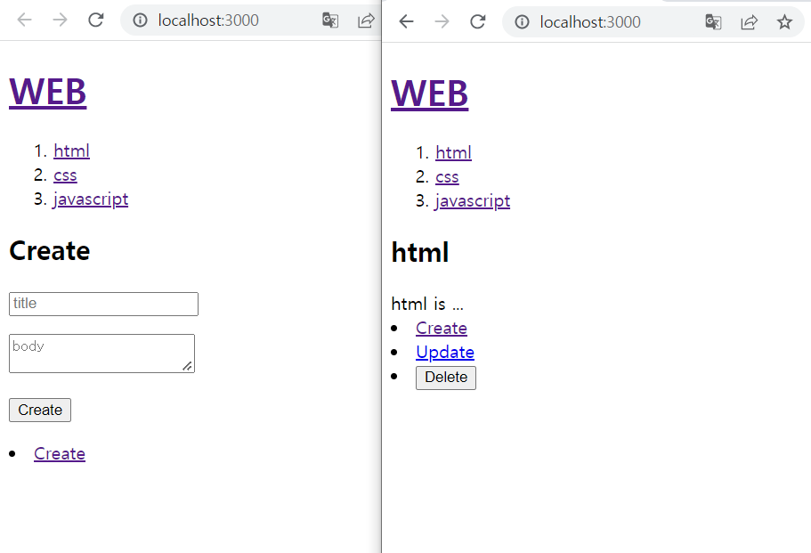
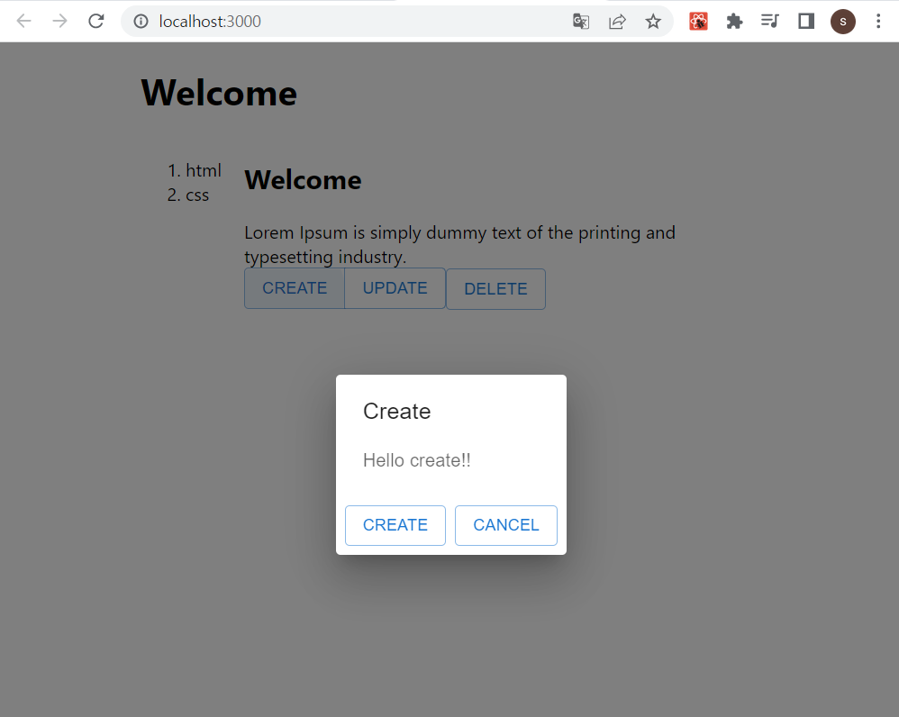
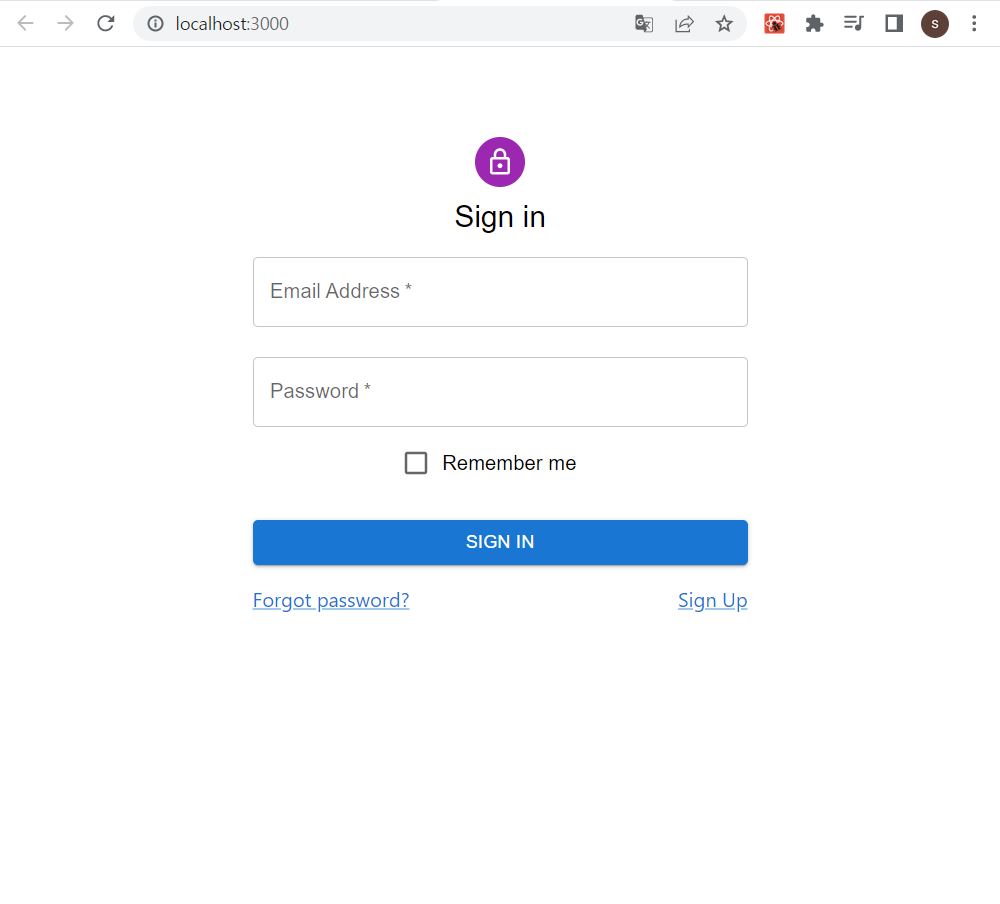

# PJT_대장간

* 성경 구절 암송 체킹 사이트 구축 프로젝트


## 학습을 위한 선행 예제 프로젝트1

### React 개념 공부

* [test-react-app](https://github.com/Sanggoe/test-react-app)
* React CRUD 구현하기 예제


### View




## 학습을 위한 선행 예제 프로젝트2

### 환경 구축

* 참고 내용
  * [Spring Boot와 React 연동하기- blog](https://velog.io/@u-nij/Spring-Boot-React.js-%EA%B0%9C%EB%B0%9C%ED%99%98%EA%B2%BD-%EC%84%B8%ED%8C%85)
  * [스프링 부트에서 리액트 설치 - Youtube](https://www.youtube.com/watch?v=1sw8UTWC8kc&t=319s)

* [spring 프로젝트 생성](https://start.spring.io/) 및 기본 의존성 추가 (Spring Web... 등)

* react 프로젝트 생성

  * [node.js 설치](https://nodejs.org/ko/)
  * bash에서 `npm install` 설치
  * 생성할 react 프로젝트 경로로 이동 및 `create-react-app .`명령어로 프로젝트를 생성
    * `src/main/react-front`

* spring, react 포트 연동

  * package.json 파일에 proxy 추가

  ```json
  "proxy": "http://localhost:8080",
  ```

  * 요건 다른 예제에서 한건데, setProxy.js 파일을 추가하는 방법을 하면 위에 프록시 추가 필요 없음

  ```js
  const { createProxyMiddleware } = require('http-proxy-middleware');
  
  module.exports = function(app) {
      app.use(
          '/api',
          createProxyMiddleware({
              target: 'http://localhost:8080',
              changeOrigin: true,
          })
      )
  }
  ```
  
  * build.gradle 파일에 의존성 추가
  
  ```groovy
  def frontendDir = "$projectDir/src/main/frontend"
  
  sourceSets {
  	main {
  		resources { srcDirs = ["$projectDir/src/main/resources"]
  		}
  	}
  }
  
  processResources { dependsOn "copyReactBuildFiles" }
  
  task installReact(type: Exec) {
  	workingDir "$frontendDir"
  	inputs.dir "$frontendDir"
  	group = BasePlugin.BUILD_GROUP
  	if (System.getProperty('os.name').toLowerCase(Locale.ROOT).contains('windows')) {
  		commandLine "npm.cmd", "audit", "fix"
  		commandLine 'npm.cmd', 'install' }
  	else {
  		commandLine "npm", "audit", "fix" commandLine 'npm', 'install'
  	}
  }
  
  task buildReact(type: Exec) {
  	dependsOn "installReact"
	workingDir "$frontendDir"
  	inputs.dir "$frontendDir"
  	group = BasePlugin.BUILD_GROUP
  	if (System.getProperty('os.name').toLowerCase(Locale.ROOT).contains('windows')) {
  		commandLine "npm.cmd", "run-script", "build"
  	} else {
  		commandLine "npm", "run-script", "build"
  	}
  }
  
  task copyReactBuildFiles(type: Copy) {
  	dependsOn "buildReact"
  	from "$frontendDir/build"
  	into "$projectDir/src/main/resources/static"
  }
  ```
  
  * front를 빌드한 다음에 back을 빌드하도록 하는 목적?
  
* `npm install axios`명령어로 <u>axios 다운로드</u>


### CORS (Cross Origin Resource Sharing)

* 서버와 클라이언트가 동일한 IP주소에서 동작하고 있다면 resource를 제약 없이 서로 공유할 수 있지만, 만약 다른 도메인에 있다면 원칙적으로 어떤 데이터도 주고받을 수 없도록 하는 매커니즘
* 해당 관련 에러를 막을 목적으로 Spring과 React의 연동을 위해 추가 proxy 설정이 필요하다.


### 변수 적용

* let name 하면 변수 초기화
* { 변수이름 } 형태로 값을 넘겨주면 된다.
* 값이 변경되어도 새로고침을 해야 렌더된다.

```jsx
import logo from './logo.svg';
import './App.css';

function App() {
  let num = 1;

  return (
    <div className="App">
      <header className="App-header">
        <div> {num} </div>
      </header>
    </div>
  );
}

export default App; 
```


### useState

* useState 쓸 때는 let 대신 const를 사용해줘야 한다.
* 상단에 React, {useState} 를 import 해서 사용해야 한다.
* 바로 실행하지 말아야 하고, 반복문과 if문 안에서 정의하면 안된다.
* 즉, 값이 변경되는 순간 자동으로 페이지가 다시 render 된다고 생각하면 된다.

```jsx
import React, { useState } from 'react'
import logo from './logo.svg';
import './App.css';

function App() {

  const [num, setNum] = useState(0); // 이런식으로 쓴다

  // setTimeout(() => { setNum(num += 1) }, 1000); 1초마다 증가 코드

  return (
    <div className="App">0
      <header className="App-header">
        <div> {num} </div>
        <button onClick={ () => { setNum(num += 1) } }> 버튼 </button>
      </header>
    </div>
  );
}

export default App; 
```


### Style 적용

* style 직접 적용시, { { } } 처럼 중괄호를 2개 써서 객체 형식으로 해주어야 한다.
* 또는 css 파일을 만들어 className이라는 속성으로 넣어줘야 한다.

```jsx
import React, { useState } from 'react'
import logo from './logo.svg';
import './App.css';

function App() {

  const [num, setNum] = useState(1);

  return (
    <div className="App">
      <header className="App-header">
        
        <div style={{color:"blue"}}>{num}</div>
        <div className='number'>{num}</div>
      </header>
    </div>
  );
}

export default App; 
```

```css
.number {
  color: red;
}
```


### 숫자 기록, 리스팅

* 현재 숫자 출력
* 버튼 눌러 증가, 감소 구현
* 저장 버튼 눌러 현재 숫자 저장 (저장시 숫자 초기화)
* 리스트로 저장된 숫자 보여주기

```jsx
import React, { useState } from 'react'
import './App.css';

function App() {

  const [num, setNum] = useState(0);
  const [numList, setNumList] = useState([]);

  function numRecording() { // 
    setNumList([...numList, num]) // js6 문법, numList.append(num)과 같은 의미의 코드로 보면 될 듯
    setNum(0)
  }

  return (
    <div className="App">
      <div>현재 숫자 : {num}</div>
      <button onClick={() => { setNum(num + 1) }}>숫자 증가</button>
      <button onClick={() => { setNum(num - 1) }}>숫자 감소</button>
      <button onClick={numRecording}>저장된 숫자</button>
      <h1>저장된 숫자</h1>
      <ul>
        {numList.map((num) => ( // num = numList.
          <li>{num}</li>
        ))}
      </ul>
    </div>
  );
}

export default App; 
```


### 함수 분리

* 지금 코드야 짧으니 함수 하나에 다 때려박지만, 나중 되면 또 많아질테니 컴포넌트들로 나누어 코딩!
* 매개변수를 받아올 때 **( { props } )** 형태로 받아와야 한다.
* 넘겨줄 때는 **key = { value }** 형태로 넘겨주며, 여기엔 변수나 배열, 함수도 넘겨줄 수 있다.

```jsx
import React, { useState } from 'react'
import './App.css';

const RecordForm = ({ numList, setNumList }) => { // (1) 매개변수 받아와야 함

  const [num, setNum] = useState(0);

  function numRecording() {
    setNumList([...numList, num]);
    setNum(0);
  }

  function recordingInit() {
    setNumList([])
  }

  return (
    <div>
      <div>현재 숫자 : {num}</div>
      <button onClick={() => setNum(num + 1)}>숫자 증가</button>
      <button onClick={() => setNum(num - 1)}>숫자 감소</button>
      <button onClick={() => setNum(0)}>숫자 초기화</button>
      <hr />
      <button onClick={numRecording }>숫자 기록</button>
      <button onClick={() => setNumList([])}>기록 초기화</button>
    </div>
  )
}

const RecordList = ({ numList }) => { // 배열 출력하는 부분 코드
  return (
    <div>
      <h2>기록된 숫자</h2>
      {numList.length > 0 ?
        <ul>
          {numList.map((num) => (
            <li>{num}</li>))}
        </ul>
        : <div>기록 없음</div>}
    </div>)
}

const App = () => {

  const [numList, setNumList] = useState([]);

  return (
    <div style={{
      margin: "40px auto",
      width: "800px",
      textAlign: "center"
    }}>
      <RecordForm numList={numList} setNumList={setNumList} />
      <RecordList numList={numList} />
    </div>
  ) // (1) 매개변수 위와 같이 넘겨줄 수 있음
}

export default App; 
```


### Input 태그

* 수정 버튼을 누르면 text 창이 뜨고 완료 버튼을 누르면 수정된 text가 출력이 되도록
* 페이지의 변경 없이 수정 되는 것이 포인트!
* 각 변수가 어떻게 넘겨지는지, 어떤게 반환 되는지 잘 살펴보자.

```jsx
import React, { useState } from 'react'

const App = () => {

  const [text, setText] = useState("") // 출력될 text 선언
  const [edit, setEdit] = useState(false); // 토글 판단할 edit 선언

  let content = <div>
    {text} <button onClick={() => setEdit(true)}> 수정하기 </button>
  </div>

  if (edit) { // 토글 edit이 true이면
    content = <div>
      <input type="text"
        value={text}
        onChange={(e) => {
          console.log(e.target.value) // 콘솔 로그 보기 코드
          setText(e.target.value)
        }}
      />
      <button onClick={() => setEdit(false)}> 수정완료 </button>
    </div>
  } // 토글 edit을 다시 false로 변경

  return (
    <div>
      {content}
    </div>
  );
}

export default App;
```


### axios로 API 통신

* [json place holder 라는 무료 fake API testing 사이트](https://jsonplaceholder.typicode.com/)
* useEffect를 이용해서 axios로 해당 url에 요청을 보내면, 응답으로 받아온 데이터를 가지고 변수에 적용한다.
* 당연히 JSON 형태의 데이터
* 근데 아래 코드는 뭔가 내컴에서는 안된다.. 뭐지...

```jsx
import React, { useState, useEffect } from 'react';
import axios from 'axios';

const App = () => {

  const [posts, setPosts] = useState([]);

  useEffect(async() => {
    // axios({
    //   method: 'GET',
    //   //url:'https://jsonplaceholder.typicode.com/posts'
    //   url: 'https://jsonplaceholder.typicode.com/photos'
    // }).then(response => setPosts(response.data))

    // axios.get('https://jsonplaceholder.typicode.com/photos')
    // .then(response => setPosts(response.data)) // 비동기 통신

    // await, promise, async 차이 검색해보세요
    try {
      const response = await axios.get('https://jsonplaceholder.typicode.com/photos');
      setPosts(response.data);
    } catch(error) {
      console.log(error)
    }
  })

  return (
    <ul>
      {posts.map(post => (
        <li key={post.id}>
          <div>{post.title}</div>
          <div></div>
        </li>
      ))}</ul>
  )
}
export default App;
```


### 백엔드에서 데이터 가져와 프론트에 뿌려보기 예제

* 앞서 위에서 proxy 관련 js 파일 만들고 환경을 구축한 다음
* intelij의 controller 파일을 추가해준다.
* 즉, 서버단에서 요청에 응답할 내용을 추가

```java
package com.sanggoe.exam.controller;

import org.springframework.web.bind.annotation.GetMapping;
import org.springframework.web.bind.annotation.RestController;

@RestController
public class HelloWorldController {

    @GetMapping("/api/hello")
    public String test() {
        return "Hello, Sanggoe!";
    }
}
```


* 아래 react의 App.js 파일에서 axios.get으로 요청

```jsx
import React, {useEffect, useState} from 'react';
import axios from 'axios';

function App() {
   const [hello, setHello] = useState('')

    useEffect(() => {
        axios.get('/api/hello')
        .then(response => setHello(response.data))
        .catch(error => console.log(error))
    }, []);

    return (
        <div>
            백엔드에서 가져온 데이터입니다 : {hello}
        </div>
    );
}

export default App;
```


## 학습을 위한 선행 예제 프로젝트3 - MUI 응용

* 환경은 위 예제와 동일
* [MUI](https://mui.com/)


### App View




### App.css

```css
.App {
  margin: 0 auto;
  margin-top: 200px;
  text-align: center;
  width: 400px;
}
```


### App.js

```jsx
import React, { useState } from 'react';
import "./App.css"
import Button from '@mui/material/Button';
import ButtonGroup from '@mui/material/ButtonGroup';
import Container from '@mui/material/Container';
import Grid from '@mui/material/Unstable_Grid2';
import Dialog from '@mui/material/Dialog';
import DialogActions from '@mui/material/DialogActions';
import DialogContent from '@mui/material/DialogContent';
import DialogContentText from '@mui/material/DialogContentText';
import DialogTitle from '@mui/material/DialogTitle';

function Header() {
  return (
    <header>
      <h1>Welcome</h1>
    </header>
  );
}

function Nav() {
  return (
    <nav>
      <ol>
        <li>html</li>
        <li>css</li>
      </ol>
    </nav>
  )
}

function LongText() {
  return (
    <>Lorem Ipsum is simply dummy text of the printing and typesetting industry.
    </>
  )
}

function Article() {
  const [open, setOpen] = useState(false);

  return (
    <article>
      <h2>Welcome</h2>
      <LongText></LongText>
      <br />
      <ButtonGroup>
        <Button
          variant="outlined"
          onClick={() => {
            setOpen(true);
          }} >
          Create</Button>
        <Button variant="outlined">Update</Button>
      </ButtonGroup>
      <Button variant="outlined">Delete</Button>
      <Dialog open={open}>
        <DialogTitle>Create</DialogTitle>
        <DialogContent>
          <DialogContentText>Hello create!!</DialogContentText>
        </DialogContent>
        <DialogActions>
          <Button variant="outlined">CREATE</Button>
          <Button
            variant="outlined"
            onClick={() => {
              setOpen(false);
            }}>
            CANCEL</Button>
        </DialogActions>
      </Dialog>
    </article>)
}

export default function App() {
  return (
    <Container fixed>
      <Header></Header>
      <Grid container>
        <Grid item xs={2}>
          <Nav></Nav>
        </Grid>
        <Grid item xs={10}>
          <Article></Article>
        </Grid>
      </Grid>
    </Container>
  )
}
```


### Login View




### Login.js

```jsx
import React from 'react';
import "./Login.css"
import { TextField, Checkbox, Button, FormControlLabel, Grid, Link, Typography, Box, Avatar, Container } from '@mui/material';
import LockOutlinedIcon from '@mui/icons-material/LockOutlined';

export default function Login() {
    return (
        <Container component="main" maxWidth="xs">
            <Box
                sx={{
                    marginTop: 8,
                    display: 'flex',
                    flexDirection: 'column',
                    alignItems: 'center',
                }}>
                <Avatar sx={{ m: 1, bgcolor: 'secondary.main' }}>
                    <LockOutlinedIcon />
                </Avatar>
                <Typography component="h1" variant="h5">
                    Sign in
                </Typography>

                <TextField label="Email Address"
                    margin='normal'
                    required
                    fullWidth
                    name="email"
                    autoComplete="email"
                    autoFocus />

                <TextField label="Password"
                    margin='normal'
                    type="password"
                    required
                    fullWidth
                    name="password"
                    autoComplete="current-password" />

                <FormControlLabel
                    control={<Checkbox value="remember" color="primary" />}
                    label="Remember me" />

                <Button type="submit"
                    fullWidth
                    variant="contained"
                    sx={{ mt: 3, mb: 2 }}>Sign in</Button>
                <Grid container>
                    <Grid item xs>
                        <Link>Forgot password?</Link>
                    </Grid>
                    <Grid>
                        <Link>Sign Up</Link>
                    </Grid>
                </Grid>
            </Box>
        </Container>
    )
}
```


## Todo (Learning Curve)

* [Spring - React 프로젝트 연동](https://www.youtube.com/watch?v=1sw8UTWC8kc&t=319s) V
* [React 사용법 간단히 배우기 - 예제 프로젝트](youtube.com/watch?v=lKYp2QQFYK4&list=PLZzruF3-_clvT8YG7aErccPAncirfPWav&index=5)  V
* [블로그 같이 켜놓고 따라해보기 - 예제 프로젝트](https://velog.io/@u-nij/Spring-Boot-React.js-%EA%B0%9C%EB%B0%9C%ED%99%98%EA%B2%BD-%EC%84%B8%ED%8C%85)  V
* [React MUI 사용법 간단히 배우기 - 예제 프로젝트](https://www.youtube.com/watch?v=or3np70c7zU&t=346s) V
* [React MUI 사용 로그인 UI 만들기 - 예제 프로젝트](https://www.youtube.com/watch?v=PWePBteFeeE) V

위에 다 완료 되었으면..

* <u>[Spring 서버단에서 데이터를 넘겨받아 React front 단에서 출력해보는 예제 따라해보기]</u> V
* [생활코딩 React 기초 강의 따라하며 개념 다시 잡기](https://www.youtube.com/watch?v=AoMv0SIjZL8&list=PLuHgQVnccGMCOGstdDZvH41x0Vtvwyxu7&index=1) V
* [Mongo DB로 하면 어떨지, 그리고 그 DB에 담길 Data 상의해보기]
* [Amsong-checker 프로젝트 View MUI 응용해서 UI 만들어가기 시작] Go!


## Front UI 구성 시작

* [모바일에서 화면 크기 Issue](https://velog.io/@eunddodi/React-%EB%AA%A8%EB%B0%94%EC%9D%BC-%EC%9B%B9-%EC%95%B1-100vh-%EC%8B%A4%EC%A0%9C-%ED%99%94%EB%A9%B4-%ED%81%AC%EA%B8%B0%EB%A1%9C-%EB%A7%9E%EC%B6%94%EA%B8%B0)
* [리액트 개발 시 chrome창 더 줄이기](https://brianshim.com/webtricks/chrome-browser-window-that-you-can-make-narrow/)
* [MUI Button Custom Style 적용관련 질문 - stack overflow](https://stackoverflow.com/questions/46486565/mui-customize-button-color)
* [Button 정렬](https://www.youtube.com/watch?v=sKeW8r_mDS0)
* [React Router](https://www.youtube.com/watch?v=WLdbsl9UwDc)
* [React Button onclick](https://coding-hyeok.tistory.com/8)
* [React 회원가입 구현해보기](https://phrygia.github.io/react/2021-11-25-mui-react/)
* [React로 양식 Form UI 구현해보기](https://www.daleseo.com/react-forms/)
* [React + Spring To-do app 만들기 프로젝트 예제](https://bedmil.tistory.com/36?category=380819)
* [React to spring data 전송](https://cookinghoil.tistory.com/106)
* [React - Spring data 주고받기 예제 따라해보자](https://smcnewbie.tistory.com/11)